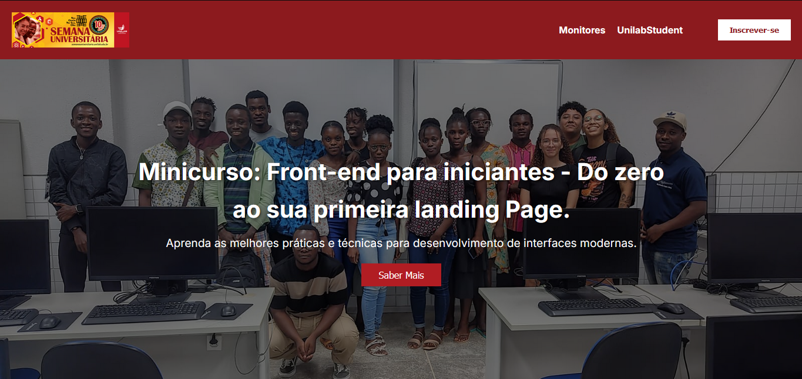

##Minicurso: Front-end para iniciantes - Do zero ao seu primeiro site.

## Sobre o Minicurso

Este minicurso foi desenvolvido para iniciantes que desejam aprender sobre desenvolvimento frontend. Durante o minicurso, abordamos os conceitos básicos de HTML e CSS, explorando como criar interfaces de usuário modernas. O objetivo é era fazer uma introdução do que é o HTML e CSS.

## Conteúdos Abordados
- Introdução ao HTML e estruturação de conteúdo
- Estilos com CSS e princípios de design responsivo
- Ferramentas de desenvolvimento e melhores práticas

### Está atividade foi desenvolvida como uma das acões da unilab student chapter na semana universitária.